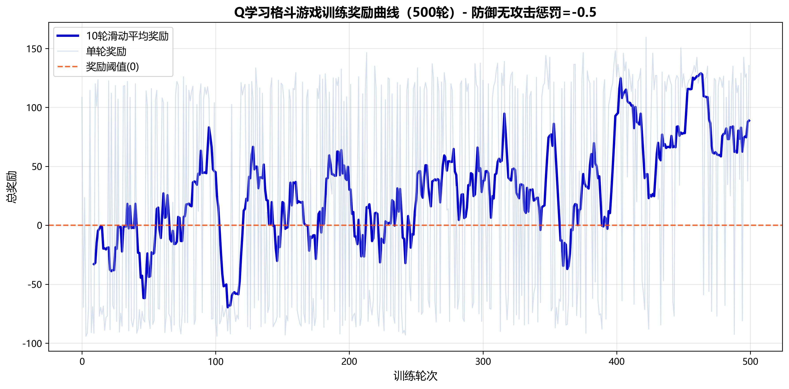
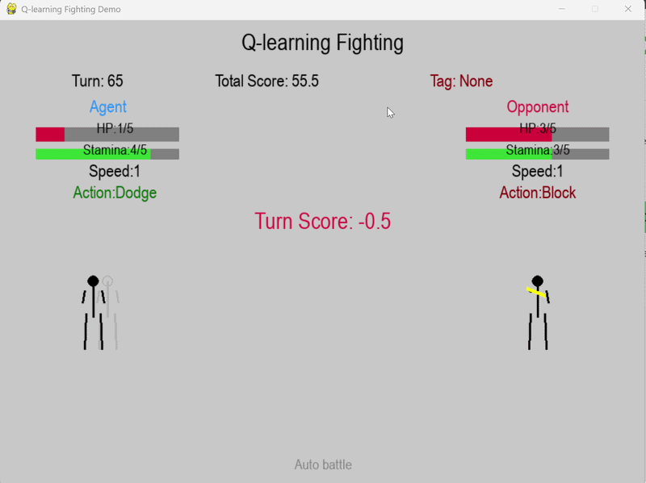

This project uses the Q-Learning algorithm to design and implement a fighting game. In this game, a trained AI-controlled fighter automatically competes against an opponent that uses a reasonable random strategy.

